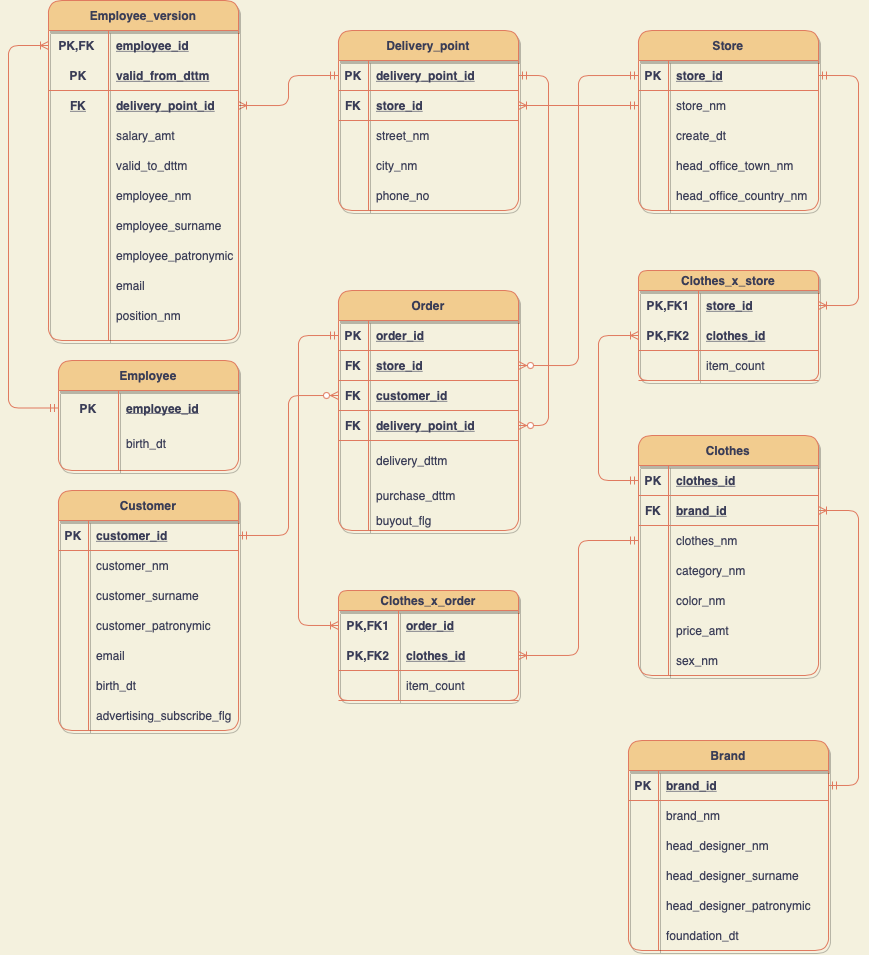

# Databases Course Project

Designing a database of online clothing stores.

## Концептуальная модель

Объяснение связей концептуальной модели:
1. Покупатель может сделать либо 0, либо больше заказов. Конкретный заказ может 
относиться только к одному покупателю.
2. Сотрудник мог либо не выдать еще ни одного заказа, если только устроился, либо уже 
выдать хотя бы один. Конкретный же заказ мог выдать только один сотрудник пункта 
выдачи.
3. Конкретный сотрудник может работать только в одном пункте доставки. В каждом 
пункте доставки может числиться и работать много сотрудников.
4. Конкретный заказ мог быть сделан только в одном магазине. В каждом 
магазине, конечно же, происходит много заказов, но возможно если магазин только появился 
еще ни один заказ не был сделан.
5. В каждом заказе есть хотя бы одна вещь, чтобы он мог считаться валидным. Одна вещь 
может появляться в разных заказах.
6. У интернет магазина может быть много пунктов выдачи, но хотя бы один точно есть. 
Каждый пункт доставки относится только к одному интернет магазину.
7. Какая-то вещь может либо нигде не продаваться, либо продаваться хотя бы в одном 
магазине. В каждом же магазине продается хотя бы одна вещь.
8. Бренд выпускает хотя бы одну вещь. Каждую вещь, так как она уникальна может 
продавать только один бренд.

## Логическая модель

БД находится в 3-ей нормальной форме. 

`1 НФ` – так как в каждой таблице для каждого атрибута содержится только одно значение.

`2 НФ` – все атрибуты зависят от первичного ключа целиком, а не от какой-то его части. В тех 
таблицах, где один первичный ключ – это очевидно выполнено. В таблицах 
`Clothes_in_order`  и  `Clothes_in_store` это так потому что количество вещей одного `id` 
зависит и от `id` магазина или заказа и от `id` вещи. Чтобы сделать версионную таблицу 
согласованной со 2-ой нормальной формой пришлось вынести версионность в отдельную 
таблицу `employee_position`, так как если оставить все это в одной таблице, то первичным 
ключом уже будет пара `employee_id` и `valid_from_dttm` и тогда такие атрибуты как, 
например, `employer_nm` будут зависеть только от части первичного ключа.

`3 НФ` - все атрибуты зависят только от первичного ключа, но не от других атрибутов. Не ясно 
как это доказывать формально, но кажется это достаточно очевидно.

Таблица `employee_position` является версионной типа `SCD2`.  В ней под каждую версию 
позиции работника создается новая строка, в которой записаны его новая позиция и 
зарплата с добавлением даты начала и конца, когда конкретный работник занимал 
конкретную должность.

##   Физическая модель

#### Customer
| Название      | Описание | Тип данных | Ограничение | PK | FK |
|------------| ------------ | ------------|------------ | ------------| ------------|
| customer_id | Уникальный идентификатор пользователя | Bigserial| Not Null, Unique | + | |
| customer_nm | Реальное имя пользователя | Varchar(40) | Not Null |  | |
| customer_surname  | Реальное фамилия пользователя | Varchar(40) | Not Null | | |
| customer_patronymic | Реальное отчество пользователя| Varchar(40) |  |  | |
| birth_dt | Дата рождения пользователя | Date |  | | |
| email | Email адрес пользователя | Varchar(50) | Not Null | | |
| advertising_subscribe_flg | Флаг означающий подписан ли пользователь на рекламную рассылку | Boolean |  | ||

#### Order
| Название | Описание | Тип данных | Ограничение | PK | FK |
|------------| --------| ------------|------------ | ------------| ------------|
| order_id | Уникальный идентификатор заказа | Bigserial| Not Null, Unique | + | |
| delivery_point_id | Уникальный идентификатор точки доставки в которую была оформлена доставка |  BigInt | Not Null, >0 |  | Delivery Point|
| store_id  | Уникальный идентификатор магазина, в котором совершена покупка |  BigInt | Not Null, >0  | | Store|
| customer_id | Уникальный идентификатор покупателя, сделавшего заказ|  BigInt | Not Null, >0 |  |Customer|
| delivery_dttm | Дата и время доставки в пункт выдачи заказа | Timestamp |  | | |
| purchase_dttm | Дата и время покупки заказа | Timestamp |  | | |
| buyoutt_flg | Флаг, который говорит был ли выкуплен заказ | Boolean |  | | |

#### Clothes_x_order
| Название | Описание | Тип данных | Ограничение | PK | FK |
|------------| --------| ------------|------------ | ------------| ------------|
| order_id | Уникальный идентификатор заказа, в котором есть такая вещь | Bigserial | Not Null | + | Store|
| clothes_id | Уникальный идентификатор вещи, которая есть в заказе |  Bigserial | Not Null | + | Clothes|
| item_count | Количество таких вещей в данном заказе | Int | Not Null |  | |

#### Employee_version
| Название | Описание | Тип данных | Ограничение | PK | FK |
|------------| --------| ------------|------------ | ------------| ------------|
| employee_id | Уникальный идентификатор сотрудника | Bigserial| Not Null, Unique | + | Employee |
| valid_from_dttm | Дата с которого занимается должность  |  Timestamp | Not Null | + | |
| delivery_point_id | Уникальный идентификатор пункта выдачи, в котором работает сотрудник|  BigInt | Not Null, >0  |  | Delivery Point|
| employee_nm | Имя сотрудника | Varchar(40) | Not Null |  | |
| employee_surname  | Фамилия сотрудника | Varchar(40) | Not Null | | |
| employee_patronymic | Отчество сотрудника| Varchar(40) |  |  | |
| valid_to_dttm | Дата до которого занималась должность | Timestamp | Not Null |  | |
| email | Email адрес сотрудника | Varchar(50) | Not Null | | |
| salary_amt  | Заработная плата сотрудника | Int |  | | |
| position_nm  | Название должности | Varchar(100) | Not Null| | |

#### Employee
| Название | Описание | Тип данных | Ограничение | PK | FK |
|------------| --------| ------------|------------ | ------------| ------------|
| employee_id | Уникальный идентификатор сотрудника | Bigserial | Not Null, Unique | + | |
| birth_dt | Дата рождения сотрудника | Date | Not Null | | |

#### Delivery Point
| Название | Описание | Тип данных | Ограничение | PK | FK |
|------------| --------| ------------|------------ | ------------| ------------|
| delivery_point_id | Уникальный идентификатор пункта выдачи |  Bigserial | Not Null, Unique | + | |
| store_id | Уникальный идентификатор магазина, к которому принадлежит пункт выдачи | BigInt | Not Null, >0 |  | Store|
| street_nm  | Улица адреса пункта выдачи | Varchar(40) | | | |
| city_nm | Город, в котором находится пункт выдачи| Varchar(40) |  |  | |
| phone_no | Телефон пункта доставки | Varchar(15) |  | | |

#### Store
| Название      | Описание | Тип данных | Ограничение | PK | FK |
|------------| ------------ | ------------|------------ | ------------| ------------|
| store_id | Уникальный идентификатор магазина | Bigserial| Not Null, Unique | + | |
| store_nm | Название магазина | Varchar(60) | Not Null |  | |
| create_dt  | Дата создания магазина | Date |  | | |
| head_office_town_nm  | Город в котором находится главный офис | Varchar(40) | | | |
| head_office_country_nm | Страна, в которой находится главный офис| Varchar(40) |  |  | |

#### Clothes_x_store
| Название | Описание | Тип данных | Ограничение | PK | FK |
|------------| --------| ------------|------------ | ------------| ------------|
| store_id | Уникальный идентификатор магазина, в котором есть такая вещь | Bigserial | Not Null | + | Store|
| clothes_id | Уникальный идентификатор вещи, которая есть в магазине |  Bigserial | Not Null | + | Clothes|
| item_count | Количество таких вещей в данном магазине | Int | Not Null |  | |

#### Clothes
| Название | Описание | Тип данных | Ограничение | PK | FK |
|------------| --------| ------------|------------ | ------------| ------------|
| clothes_id | Уникальный идентификатор вещи| Bigserial| Not Null, Unique | + | |
| brand_id | Уникальный идентификатор бренда, выпустившего эту вещь|  BigInt | Not Null, >0  |  | Brand|
| clothes_nm | Название вещи | Varchar(100) | Not Null |  | |
| category_nm  | Категория одежды, к которой принадлежит вещь | Varchar(40) | Not Null | | |
| color_nm | Название цвета вещи| Varchar(40) |  |  | |
| price_amt | Стоимость | Int | Not Null | | |
| sex_nm | Пол, для которого была сделана | Varchar(50) | | | |

#### Brand
| Название      | Описание | Тип данных | Ограничение | PK | FK |
|------------| ------------ | ------------|------------ | ------------| ------------|
| brand_id | Уникальный идентификатор бренда | Bigserial| Not Null, Unique | + | |
| brand_nm | Название бренда | Varchar(40) | Not Null |  | |
| head_designer_nm  | Имя главного дизайнера| Varchar(40) | Not Null | | |
| head_designer_surname | Фамилия главного дизайнера| Varchar(40) |Not Null   |  | |
| head_designer_patronymic | Отчество главного дизайнера| Varchar(40) |  |  | |
| foundation_dt | Дата основания бренда | Date |  | | |
